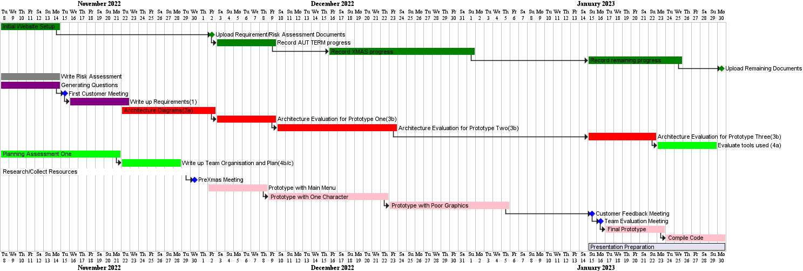
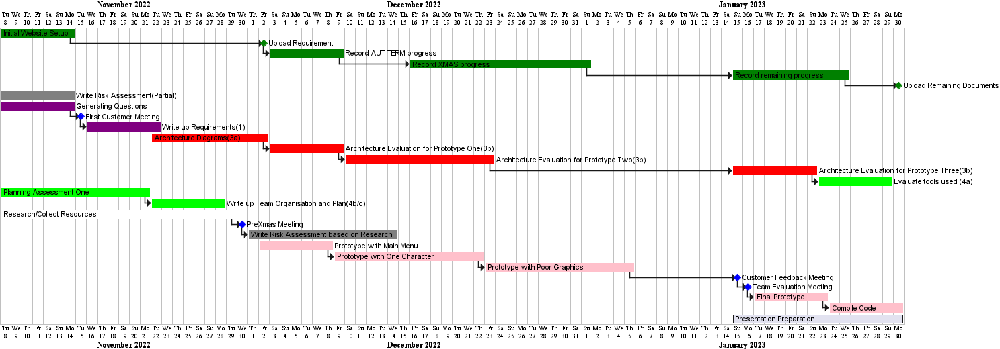
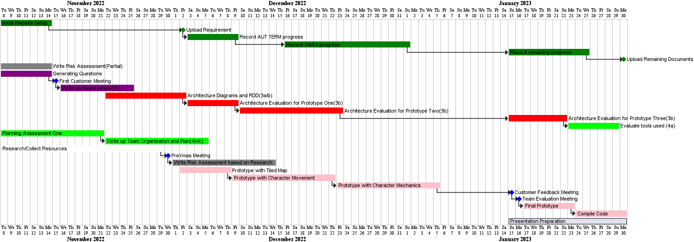

## Weekly Updates

# Aut/7 - The first week

This week was all about team building as it was the first time, 
we had been together as a group. We met up outside of the designated 
practical to setup Git and Github collectively and setup over repos 
under an organisation.

Main goals achieved includes:

* Understanding requirements collectively.
* Group forming exercises.

# Aut/8 - Start planning!

This week was about thinking how to go forward as a team. 
When we arrived at our ENG practical, we brainstormed a gantt chart
on paper and decided what tasks we could all be interested in
doing. The main thing that we decided we could be working on include:

* Risk Management
* Requirements
* Building the website

Tasks set for everyone this week include:

* Lachlan and Fawwaz - Researching how to design requirements
via the extended reading, decide on what questions to ask our
customer.
* Vivek - Get the website up and running and finish Gantt chart.
* Dengy - Explore Graphics libraries and collect Graphics pack.
* Sam and Milo - Work on the risk management deliverable via
reading, google and lectures.

# Aut/9 - Requirements complete

Continued with last week's work. The main things we learnt was
that the more project specific risks, would be more useful to
do a later date (after we have a better idea of the architecture
and more research done).

This main thing that we have been working on are:

* Requirements - The document is now finished!
* Starting to complete a libGDX tutorial to get familiar
with the language.

Tasks set for this week include:

* Trying to get more familiar with libGDX.

# Aut/10 - Responsibility Driven Design

The team spent the last week learning about OpenGDX. Today, we have 
been following responsibility driven design, in order to brainstorm 
ideas for our architecture. We have brained stormed ideas
using the methods described on the lecture.

We realised that our current prototyping method for implementation does
not make sense. Hence, after research, we have changed the stages in 
our prototyping method.

The main things we have been working on are:

* Behavioural Diagrams
* Structural Diagrams
* Cards

Test set for this week include:

* Start development by developing map using Tiled.
* Finish architecture document.

# Break/WK1 - Starting to Code

# Break/WK2 - Character Movement

# Break/WK3 - Merry Christmas!

# Break/WK4 - Limited Work due to Exam Revision
