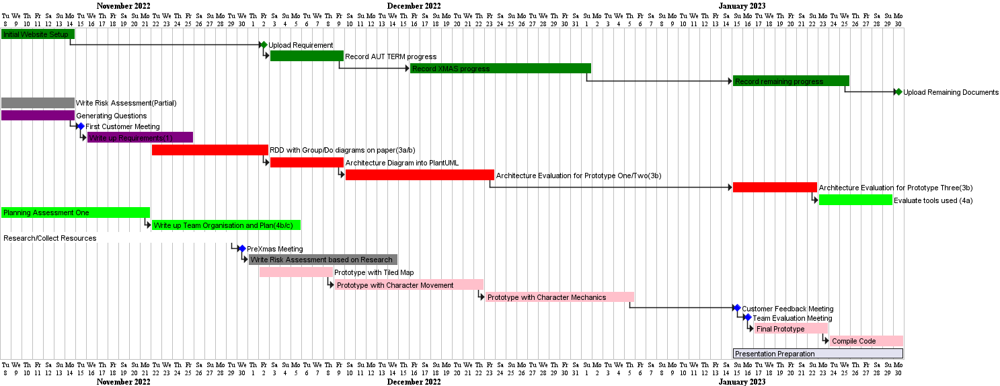
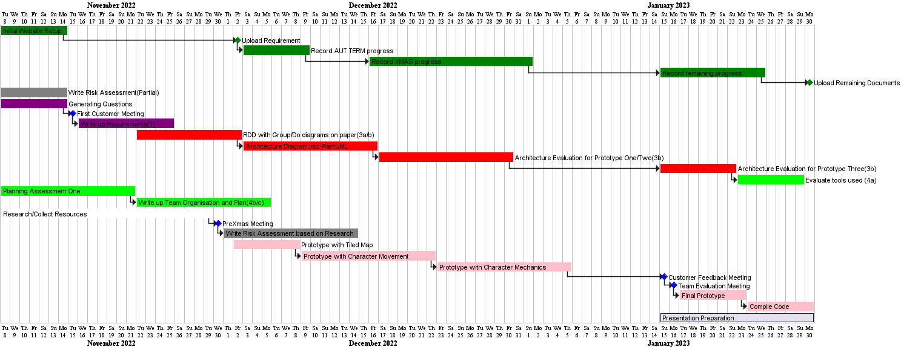
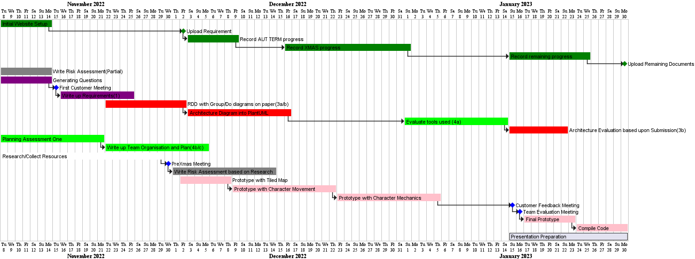
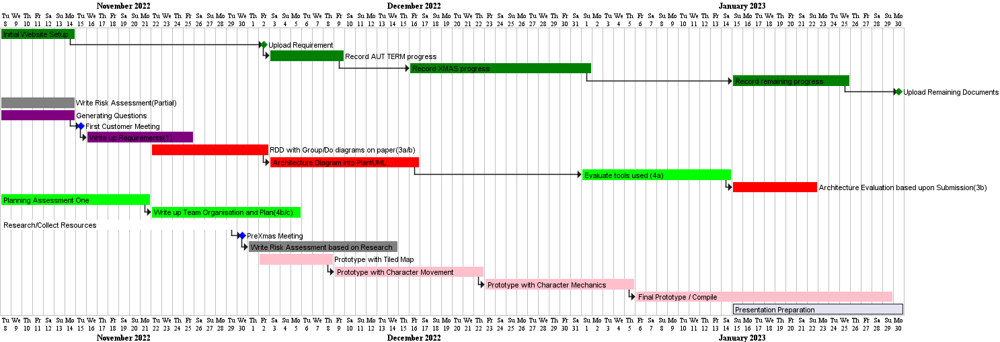

## Weekly Updates

# Aut/7 - The first week

This week was all about team building as it was the first time, 
we had been together as a group. We met up outside the designated 
practical to setup Git and Github collectively and setup over repos 
under an organisation.

Main goals achieved includes:

* Understanding requirements collectively.
* Group forming exercises.

# Aut/8 - Start planning!

This week was about thinking how to go forward as a team. 
When we arrived at our ENG practical, we brainstormed a gantt chart
on paper and decided what tasks we could all be interested in
doing. The main thing that we decided we could be working on include:

* Risk Management
* Requirements
* Building the website

Tasks set for everyone this week include:

* Lachlan and Fawwaz - Researching how to design requirements
via the extended reading, decide on what questions to ask our
customer.
* Vivek - Get the website up and running and finish Gantt chart.
* Dengy - Explore Graphics libraries and collect Graphics pack.
* Sam and Milo - Work on the risk management deliverable via
reading, google and lectures.

# Aut/9 - Requirements complete

Continued with last week's work. The main things we learnt was
that the more project specific risks, would be more useful to
do a later date (after we have a better idea of the architecture
and more research done).

This main thing that we have been working on are:

* Requirements - The document is now finished!
* Starting to complete a libGDX tutorial to get familiar
with the language.

Tasks set for this week include:

* Trying to get more familiar with libGDX.

# Aut/10 - Responsibility Driven Design

The team spent the last week learning about OpenGDX. Today, we have 
been following responsibility driven design, in order to brainstorm 
ideas for our architecture. We have brained stormed ideas
using the methods described on the lecture.

We realised that our current prototyping method for implementation does
not make sense. Hence, after research, we have changed the stages in 
our prototyping method.

The main things we have been working on are:

* Behavioural Diagrams
* Structural Diagrams
* Cards

Test set for this week include:

* Start development by developing map using Tiled.
* Finish architecture document.

# Break/WK1 - Starting to Code

* Dengy started on the group organisation document.
* Vivek started coding with the plan to hand the code over 
to Sam the following week.
* Used tiled and started collect the assets to build it.
* Added links to a markdown file within the assets folder to
keep track of what is being used.

* Architecture deliverable plans based upon final meeting of term.
* Still waiting on architecture diagrams - we already had
it written up, but it needed to be implemented using UML
diagrams.

Ongoing Tasks:

* Character Movement 
* Architecture diagrams in RDD.
* Team Organisation Deliverable (PART A)

# Break/WK2 - Character Movement

* Sam implement character movement based upon the tutorial
some of us completed.
* Vivek spoke about his code over a Discord call.
* Start to learn about how to use tiled Object Layers 
within LibGDX.
* Automatic customer movement where they randomly 
choose a recipe and this is printed to the terminal.

* Lack of progress means work on the website has been 
halted to enable focus on implemented.
* Shifted this to first week back as there has 
been fewer updates than during term time.

* Still waiting on architecture diagrams - we already had
it written up, but it needed to be implemented using UML
diagrams. - Extend time on the gantt chart.

# Break/WK3 - Merry Christmas!

* No work done but this was factored in during planning.
* No Gantt Chart update for this week.

# Break/WK4 - Limited Work due to Exam Revision

* Ingredient Station screen implemented.
* Using screen manager for multiple screens/
* Help screen to display what ingredients user
has as well as the recipes.
* Recipes now saved within an array list.

* Lack of communication/ progress over Christmas
has significantly affected the workflow.
* Solo work from Vivek to catch up includes working the 
initial architecture diagram in between.

* Weekly tasks have not been set on a weekly basis due to
availability and lack of communication.

# Spr/WK1 - Exam Week

* Planned break due to exams which has been countered in for.
* No gantt chart update for this week.

# Spr/WK2 - Final Stages of implementation

* We had to re-plan based upon the priority of tasks.
* Milo and Vivek started doing pair programming to get 
a good foundation of the code which can be worked on 
separately.
* Due to the lack of time left and resources, we are
no longer conducting the meetings we planned - 
however, we have been communicating with our customer 
during our practicals.

Tasks set this week:

* Collision Detection for Sam
* Architecture Diagram changes since development for Lachlan
* Improving the help screen visually for Dengy
* Fixing the hitboxs and adding docstrings for Milo
* Add audio and some bug fixes for Vivek

# Spr/WK3 - Wrapping everything up

* Core functionality is now fully implemented.
* Decided on what needs to be done for the rest of the week.
* Collision Detection seems quite problematic so we moved the ownership of the task to someone else.
* Architecture diagrams weren't done so ownership of the task got transferred.

* Less focus on using Gantt Charts as we are at the stage where it is more about refining details.

Tasks set this week:

* Architecture - Create up-to-date diagrams, say why its changed
and link it back to requirements
* Website - Get all hyperlinks working and have final updates.
* Method Selection and Planning - Explains strengths of 
group member to explain table and provide a summary of what 
actually happened.
* Implementation - Finishing touches (between Vivek + Milo)
and compile into JAR file.

* No Gantt Chart this week - same as last week